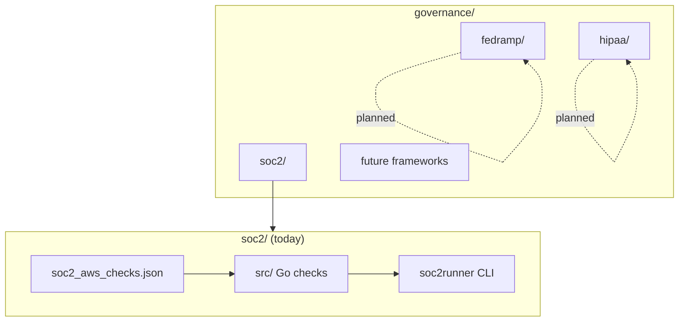

# Governance & Compliance

A learning workspace for **cloud and organizational compliance frameworks** — automated checks, control catalogs, and runnable validators. Each framework lives in its own subdirectory so SOC 2, FedRAMP, HIPAA, and others can grow independently without colliding.

---

## Repository layout

```text
governance/
├── README.md                 # This file — index for all frameworks
│
├── soc2/                     # SOC 2 Type II (implemented)
│   ├── soc2_aws_checks.json  # Control catalog (AWS + company process)
│   └── src/            # Go check implementations (56 checks)
│
├── fedramp/                  # FedRAMP — planned
│   └── (reserved)
│
├── hipaa/                    # HIPAA — planned
│   └── (reserved)
│
└── (future frameworks)       # e.g. PCI-DSS, ISO 27001, NIST 800-53
```

---

## Framework overview

| Framework | Directory | Status | Focus |
| --- | --- | --- | --- |
| **SOC 2** | [`soc2/`](soc2/) | Active | Trust Service Criteria (CC, A, C, PI, P); AWS technical + company process checks |
| **FedRAMP** | [`fedramp/`](fedramp/) | Planned | Federal cloud security (NIST 800-53 baselines, Moderate/High) |
| **HIPAA** | [`hipaa/`](hipaa/) | Planned | PHI safeguards (Security, Privacy, Breach Notification rules) |
| *PCI-DSS* | — | Future | Payment card data |
| *ISO 27001* | — | Future | ISMS controls |
| *NIST 800-53* | — | Future | Shared control catalog (often overlaps FedRAMP) |

---

## Architecture



Each framework is expected to follow the same pattern:

1. **Catalog** — machine-readable controls (JSON/YAML)
2. **Code** — one implementation file per check (Go, or other language)
3. **Runner** — CLI or CI job to execute checks and gate releases

---

## SOC 2 (implemented)

SOC 2 covers security, availability, confidentiality, processing integrity, and privacy. This repo implements checks aligned with **SOC 2 Type II** Trust Service Criteria.

### Contents

| Path | Description |
| --- | --- |
| [`soc2/soc2_aws_checks.json`](soc2/soc2_aws_checks.json) | 56 controls: 31 AWS resource checks + 25 company process checks |
| [`soc2/src/`](soc2/src/) | Go package — one `.go` file per check |
| [`soc2/src/README.md`](soc2/src/README.md) | Build, run, and regenerate instructions |

### AWS services covered

IAM · S3 · EC2 · RDS · CloudTrail · KMS · VPC · GuardDuty · AWS Config

### Quick start

```bash
cd soc2/src
go mod tidy
go build -o bin/soc2runner ./cmd/soc2runner

./bin/soc2runner -aws                 # AWS checks
./bin/soc2runner -check IAM-001       # Single check (root MFA)
```

Regenerate Go files after editing the JSON catalog:

```bash
cd soc2/src
python3 scripts/generate_checks.py
```

---

## FedRAMP (planned)

FedRAMP authorizes cloud services for U.S. federal use based on **NIST SP 800-53** control baselines (Low, Moderate, High).

### Intended layout

```text
fedramp/
├── fedramp_aws_checks.json     # Control catalog mapped to 800-53 / FedRAMP
├── fedramp-code/               # Per-control Go (or policy) implementations
├── baselines/
│   ├── low/
│   ├── moderate/
│   └── high/
└── README.md
```

### Planned focus areas

- AC — Access control (IAM, federation, PAM)
- AU — Audit and accountability (CloudTrail, centralized logging)
- CM — Configuration management (AWS Config, drift)
- CP — Contingency planning (backups, multi-region)
- IA — Identification and authentication (MFA, key rotation)
- SC — System and communications protection (encryption, boundary protection)

*Status: directory reserved — controls and code not yet added.*

---

## HIPAA (planned)

HIPAA Security Rule safeguards for **ePHI** (electronic protected health information) in cloud environments.

### Intended layout

```text
hipaa/
├── hipaa_aws_checks.json       # Technical safeguards + organizational mapping
├── hipaa-code/                 # Per-check implementations
├── safeguards/
│   ├── administrative.md
│   ├── physical.md
│   └── technical.md
└── README.md
```

### Planned focus areas

- Access controls and audit logs for systems touching PHI
- Encryption at rest and in transit (RDS, S3, TLS)
- Integrity controls and transmission security
- Minimum necessary access and workforce procedures
- BAA-aligned vendor and logging retention practices

*Status: directory reserved — controls and code not yet added.*

---

## Adding a new framework

1. Create a top-level folder: `governance/<framework>/`
2. Add `<framework>_checks.json` (or YAML) with control metadata
3. Add `<framework>-code/` with one file per check and a registry
4. Add `<framework>/README.md` with run instructions
5. Update this file’s table and layout diagram

Suggested naming:

| Item | Pattern |
| --- | --- |
| Catalog | `{framework}_aws_checks.json` |
| Code | `{framework}-code/` |
| CLI | `cmd/{framework}runner/` |

---

## Shared conventions

Across frameworks, checks should include:

| Field | Purpose |
| --- | --- |
| `id` | Stable identifier (e.g. `IAM-001`, `AC-2`) |
| `name` | Short title |
| `description` | What is being verified |
| `severity` | `critical` / `high` / `medium` / `low` |
| `remediation` | How to fix a failure |
| `criteria` | Framework-specific control mapping |
| `evidence` | Artifacts for manual/process checks |

Automated AWS checks should map to **AWS Config rules** or equivalent API validation where possible.

---

## CI integration (recommended)

```text
PR / push
  → unit tests per framework
  → run AWS checks (credentials via OIDC)
  → fail on critical/high findings
  → publish report artifact
```

Example (SOC 2):

```bash
cd soc2/src && go test ./... && ./bin/soc2runner -aws -json > report.json
```

FedRAMP and HIPAA runners will follow the same pattern when added.

---

## Related paths

| Document | Location |
| --- | --- |
| SOC 2 check catalog | [`soc2/soc2_aws_checks.json`](soc2/soc2_aws_checks.json) |
| SOC 2 Go implementation | [`soc2/src/README.md`](soc2/src/README.md) |

---

## Roadmap

- [x] SOC 2 — JSON catalog + 56 Go checks + CLI
- [ ] FedRAMP — NIST 800-53 Moderate baseline catalog
- [ ] HIPAA — ePHI technical safeguard checks
- [ ] Shared `pkg/governance` types across frameworks (optional)
- [ ] Unified multi-framework runner CLI
- [ ] GitHub Actions workflow per framework

---

## License

MIT License — see [LICENSE](LICENSE).
